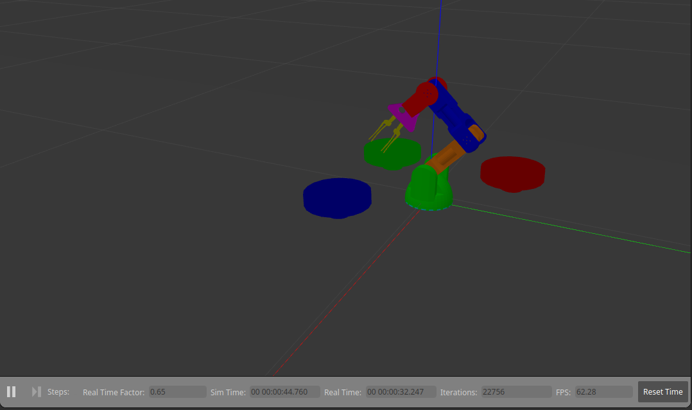
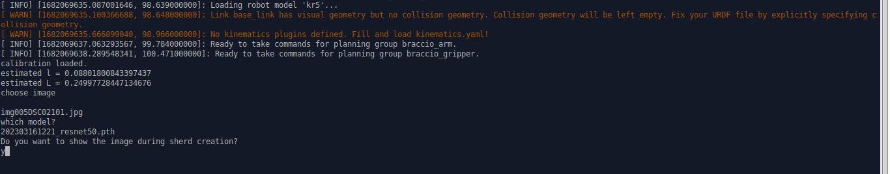
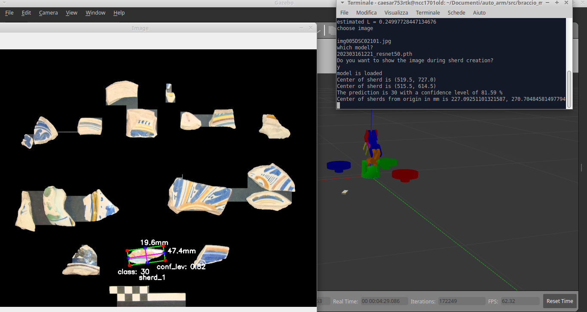
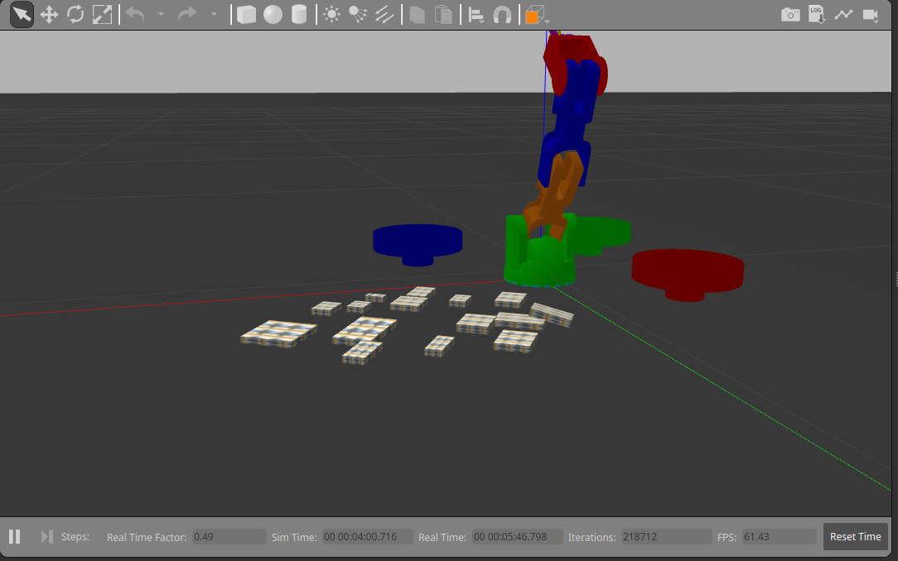
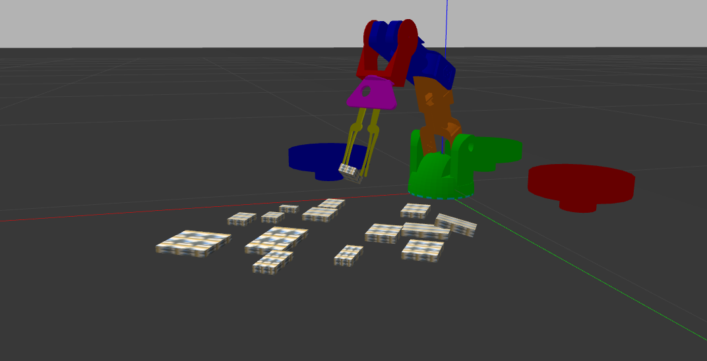
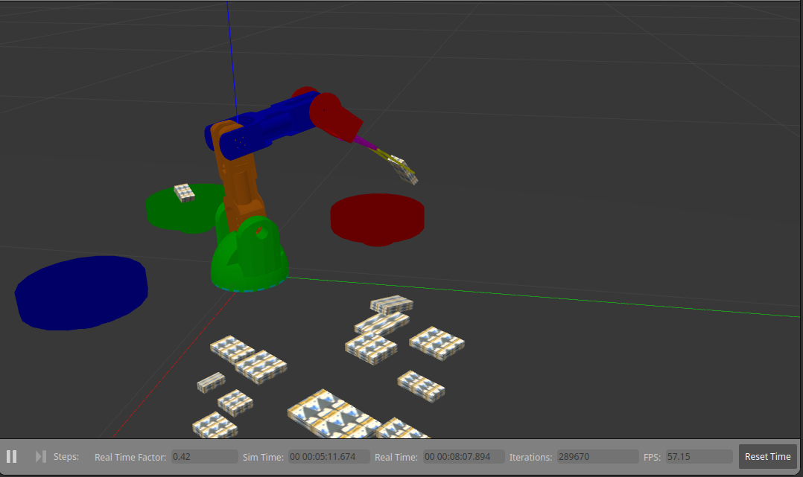

# Braccio Automatic Pick+Drop Simulation with ROS MoveIt and Gazebo
This is a package forked from [lots-of-things repository](https://github.com/lots-of-things/braccio_moveit_gazebo), updated to Ros noetic and python3.

This is a standalone simulation of a Tinkerkit Braccio arm: in the scene there are the arm and three boxes which (cylindrical bowls) in which will be put the sherds/objects created by the script `auto_main.py`.  
The script reads and segments an image in which there are some pottery sherds, these are recognized by a trained CNN and each of the is associated to a class with an accuracy metric, this information with the center and the dimension of the sherd are stored and then processed to choose the three most representative classes whose sherds will be picked and put in the bowlas

## Installation

### Prequisities
*  Tested on ROS NOETIC
*  Required Packages:
```
sudo apt-get install ros-noetic-gazebo-ros-pkgs 
sudo apt-get install ros-noetic-gazebo-ros-control
sudo apt-get install ros-noetic-moveit
```

### Download and build source
```
mkdir -p auto_braccio/src
cd auto_braccio/src
git clone git@github.com:caesar753/braccio_moveit_gazebo_noetic.git
git checkout auto
cd ..
catkin_make
```

## Usage

### Launch the programs

Start up two bash terminal sessions and navigate to the workspace directory (`auto_braccio` above).

In the first terminal run the following to bring up the Gazebo simulation.
```
source devel/setup.bash
roslaunch braccio_moveit_gazebo rviz_connected_with_gz_using_moveit.launch
```

Gazebo should open with a scene that contains the robot and the items (arm and bowls).  You may need to reposition the display camera to see everything.



In the second terminal run this to bring up the command line control interface
```
source devel/setup.bash
cd src/braccio__moveit_gazebo_noetic/braccio_moveit_gazebo/scripts
rosrun braccio_moveit_gazebo auto_main.py
```

### Recognition of image, creation and selection of the sherds

The program will ask you the image to be recognized, the image MUST contatin a chessboard meter of 100mm lenght at the bottom (you can use `img005DSC02101.jpg` which is located in `scripts` folder) and the trained CNN (you can use `202303161221_resnet50.pth` located in the same folder) and if you want to display the image with recognition information (choose `y/n`).


After a few seconds some texturized boxes will show on the scene, in the terminal in which you launched the script some information will be displayed (center of sherd in pixels and mm, class).



After sherds creation the arm will move and picks the fragments of the choosen classes, dropping them into the corresponding bowl (each bowl is associated to only one class).



This is a short video to illustrate how the arm works


## Learn more

In [original lots-of-things repository](https://github.com/lots-of-things/braccio_moveit_gazebo) there is a more elaborate [blog post](#), that explains the internals in more detail. It covers the inverse kinematics solution, Gazebo+Moveit URDF setup, and Gazebo physics engine fine-tuning.

The original lots-of-things repository](https://github.com/lots-of-things/braccio_moveit_gazebo) is a subtask in the creation of my [`su_chef` project](https://bonkerfield.org/su_chef/), an open-source, automated food prep assistant.

## Contact

For bugs, you can file [an issue](https://github.com/caesar753/braccio_moveit_gazebo_noetic/issues) and I'll take a look.

## Credits
